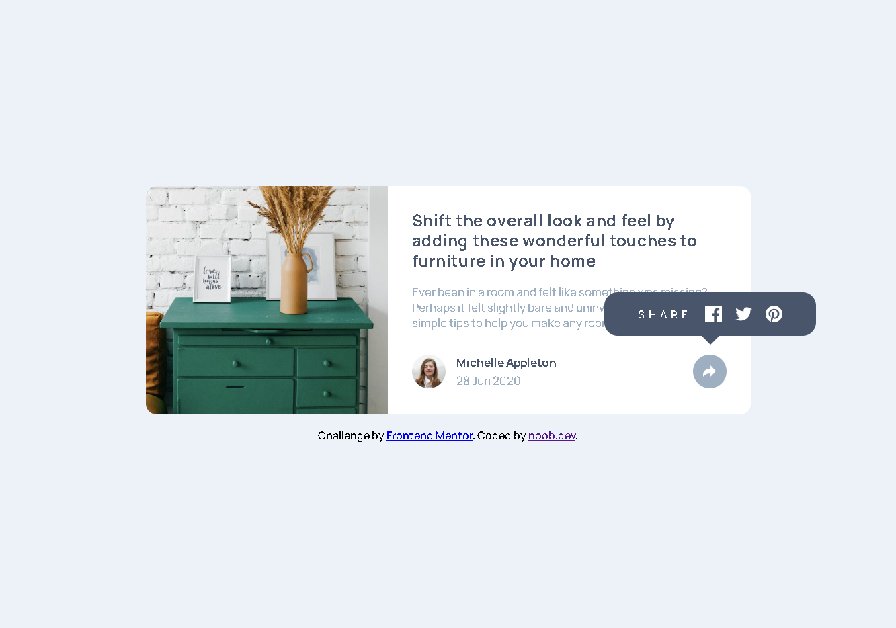

# Frontend Mentor - Article preview component

This is a solution to the [Article preview component challenge](https://www.frontendmentor.io/challenges/article-preview-component-dYBN_pYFT). 

## 📸 Screenshot

## 🧠 What I Learned
- Improved my CSS Flexbox and responsive design skills
- Learned how to toggle elements dynamically using JS
- Practiced using media queries for mobile layouts

## 🧩 Built With
- Semantic HTML5 markup
- CSS custom properties
- Flexbox
- JavaScript

## 🚀 Live Demo
[🔗 View Site](https://noobdev08.github.io/fm-article-preview-ui/)

## 👨‍💻 Author
- Frontend Mentor – [@noobdev08](https://www.frontendmentor.io/profile/noobdev08)
- GitHub – [@noobdev08](https://github.com/noobdev08)
